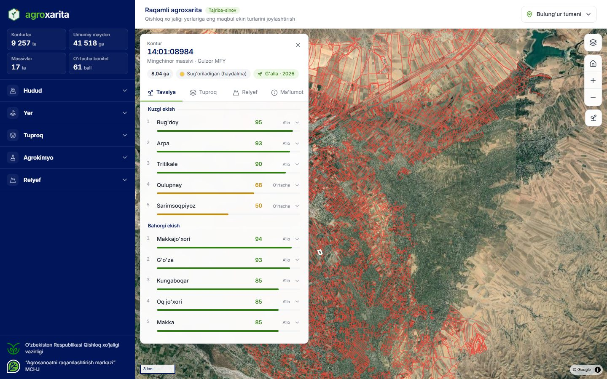
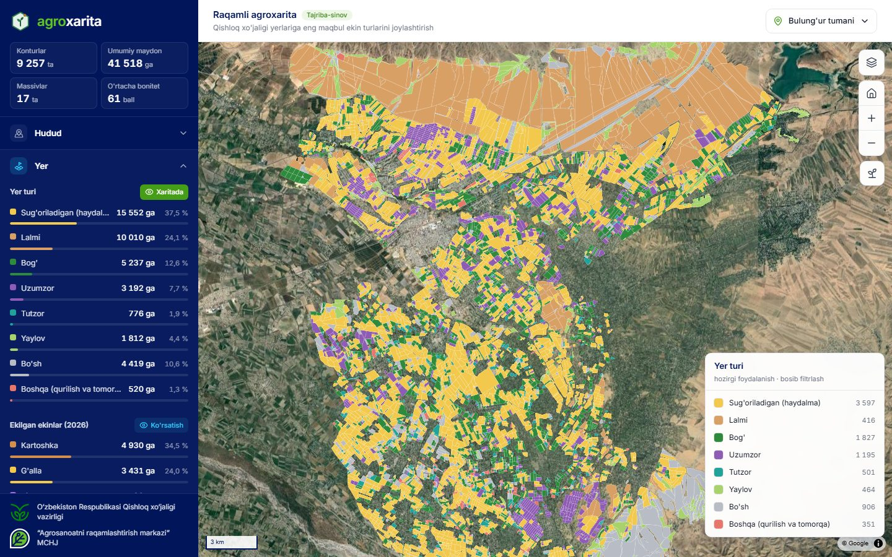
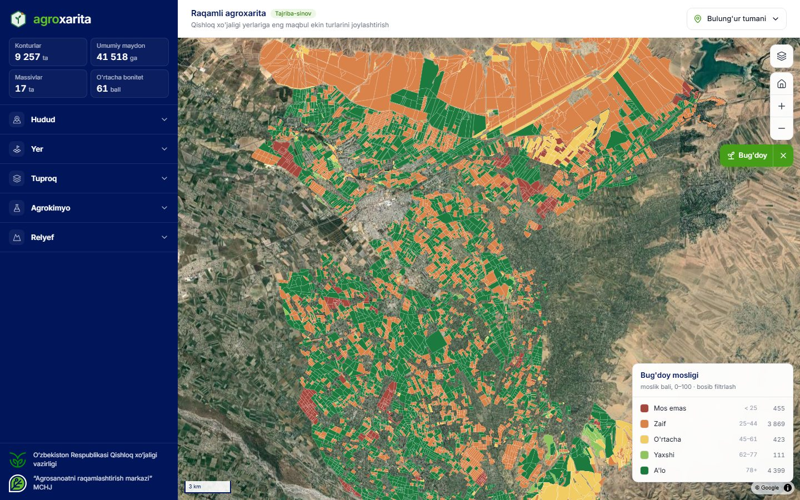
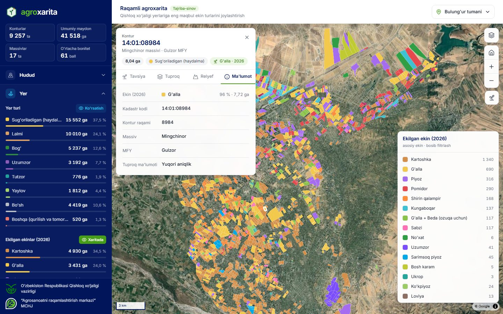
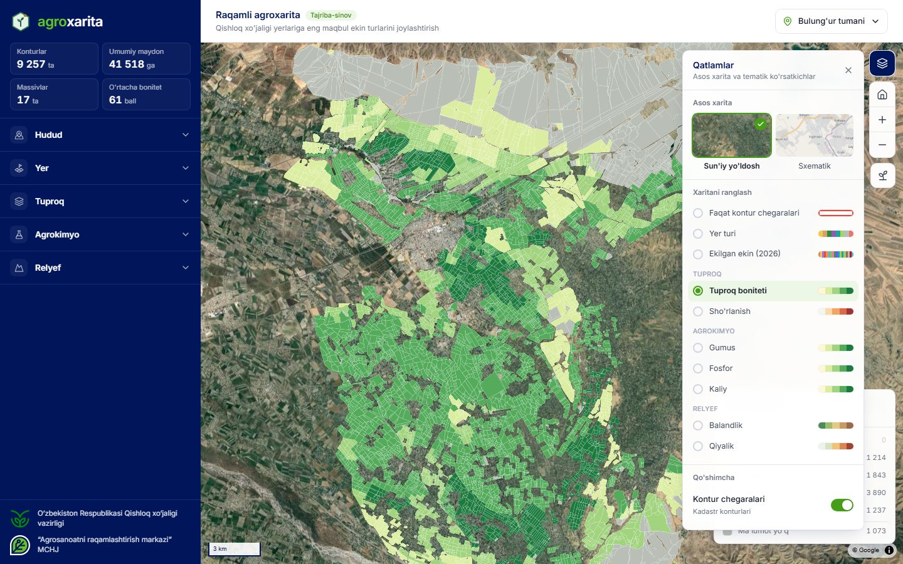

# Agroxarita

**Raqamli agroxarita**: qishloq xo‘jaligi yerlarining har bir konturi bo‘yicha tuproq, relyef va agrokimyo tahlili asosida eng maqbul ekin turlarini tavsiya etadigan veb-xarita.

## Loyiha maqsadi

Loyiha O‘zbekiston Respublikasi Prezidentining **PF-68-son farmoni** (24.04.2026) asosida tajriba-sinov tariqasida ishlab chiqilmoqda. Unda Farg‘ona va Bulung‘ur tumanlari qishloq xo‘jaligi yerlarida har bir kontur bo‘yicha quyidagilarni tahlil qilish belgilangan:

- tuproq tarkibi;
- joylashuv relyefi;
- suv bilan ta’minlanganlik;
- meteorologik va agrotexnik ko‘rsatkichlar.

Shu tahlil asosida eng maqbul ekin turlarini joylashtirish kerak.

Birinchi bosqich **Bulung‘ur tumani**: 9 257 kontur, 41 518 ga.

## Imkoniyatlari

- **Ekin tavsiyasi.** Har bir kontur uchun 37 ta ekin 0–100 ball bilan baholanadi va kuzgi hamda bahorgi ekish bo‘yicha guruhlanadi. Har bir baho yonida sababi ko‘rsatiladi: bonitet, sho‘rlanish, qiyalik, o‘g‘it talabi.
- **Ekin mosligi xaritasi.** Ekin tanlansa, butun tuman shu ekinga mosligi bo‘yicha ranglanadi.
- **Tematik qatlamlar.** Yer turi, 2026-yil ekinlari, tuproq boniteti, sho‘rlanish, gumus, fosfor, kaliy, balandlik va qiyalik bo‘yicha qatlamlar mavjud.
- **Statistika.** Hudud, yer turi, tuproq, agrokimyo va relyef bo‘yicha maydon va ulushlar ko‘rsatiladi.
- **Kontur kartasi.** Kadastr raqami, maydon, yer turi, ekilgan ekin, tuproq va relyef ko‘rsatkichlari bir joyda jamlangan.
- **Legenda orqali filtrlash.** Legendadagi klass bosilsa, xaritada faqat o‘sha klassdagi konturlar qoladi.

## Ko‘rinishlar

| Yer turlari | Ekin mosligi (bug‘doy) |
|---|---|
|  |  |
| **2026-yilda ekilgan ekinlar** | **Qatlamlar va tuproq boniteti** |
|  |  |

## Ma’lumotlar

| Manba | Mazmuni |
|---|---|
| Kadastr konturlari | 9 257 kontur: maydon, massiv, MFY, yer turi |
| Tuproq bonitirovkasi | bonitet, mexanik tarkib, sho‘rlanish |
| Agrokimyo | gumus, fosfor, kaliy |
| SRTM 30 m | balandlik, qiyalik, yo‘nalish |
| Ekin xaritasi 2026 | 1 600 poligon, 18 ta ekin, konturlarga intersect orqali bog‘langan |

---

<table>
  <tr>
    <td></td>
    <td>O‘zbekiston Respublikasi Qishloq xo‘jaligi vazirligi</td>
    <td></td>
    <td>“Agrosanoatni raqamlashtirish markazi” MCHJ</td>
  </tr>
</table>
